Nota: Uso REST + WebSocket. Prefixo sugerido: /api/*. Respostas padrão: { "ok": true|false, "msg": "texto opcional" }. Eventos em tempo real via WebSocket: status, wifi, alert, ack, error, log.

🧭 Cabeçalho
1) Botão de Tema (Claro / Escuro / Automático)

Front‑end: Alterna entre light → dark → auto. Atualiza UI imediatamente e salva preferência.
Chamada (opcional para persistir):
POST /api/theme → { "mode": "light"|"dark"|"auto" }
Firmware (persistência): cfg_setTheme(mode) → salva em config.json.
Resposta esperada: {"ok":true}
Efeitos: Persistir para manter tema após reboot.
Erros/UI: Se falhar persistência, manter tema local e exibir toast: “Não foi possível salvar o tema”.

2) Botão de Configurações

Front‑end: Abre o Menu de Configurações (modal/aba).
Chamada: Nenhuma (apenas UI).

3) Botão Alerta Geral ON/OFF

Front‑end: Toggle global de alarmes (habilita/desabilita TODAS as ações de alerta).
Chamada:
POST /api/alerts/global → { "enabled": true|false }
Firmware: alerts_setGlobal(enabled)

Se false: interromper bip/LED ativos e suprimir envio de mensagens.

Resposta: {"ok":true}
Eventos WS: {"type":"ack","for":"alerts.global","enabled":...}
Erros: Toast com motivo. Manter estado anterior no UI se falhar.

4) Ícone Status Wi‑Fi (conectado/desconectado)

Front‑end (clique): Abre diagnóstico rápido (SSID atual, IP, RSSI, modo STA/AP, botão “Scan”).
Chamada (diagnóstico): GET /api/wifi/state
Chamada (scan): GET /api/wifi/scan
Firmware: wifi_getState(), wifi_scan()
Eventos WS: {"type":"wifi","state":{...}}
Erros: Exibir mensagem “Falha ao obter estado/scan”.

📊 Corpo Principal
5) Botão Modo PWM: Manual / Automático

Front‑end: Alterna modo e atualiza rótulo.

Se Manual: (opcional na UI) habilita slider PWM (não é botão, mas relacionado).
Se Automático: slider desabilitado (controle por temperatura).

Chamada:
POST /api/control/mode → { "mode": "manual"|"auto" }
Firmware: control_setMode(mode); se manual, usar último pwmManual; se auto, seguir algoritmo (histerese/PID).
Resposta: {"ok":true,"mode":"auto|manual"}
Erros: Reverter estado visual e toast.

Se houver slider PWM (não botão):
POST /api/control/pwm → { "duty": 0..100 } → control_setManualPwm(duty) (apenas no modo manual).

⚙️ Menu de Configurações
📶 Aba Wi‑Fi
6) Cliente – Botão Salvar

Front‑end: Entra em loading, bloqueia inputs, mostra indicador de teste.
Chamada:
POST /api/wifi/sta → { "ssid": "texto", "pass": "texto" }
Firmware:

wifi_setSTAConfig(ssid, pass) (salva).
wifi_connectAsync(timeout=15s) (teste assíncrono).
Emite WS: {"type":"wifi","testing":true} → {"type":"wifi","connected":true|false,"ip":"..."}.

Resposta imediata: {"ok":true,"testing":true}
UI pós‑teste:

Sucesso: ícone verde, salva e (opcional) desliga AP se conectado (segurança).
Falha: ícone vermelho + mensagem.

Erros: Campos inválidos → feedback inline + toast.

7) Ponto de Acesso – Botão Salvar

Front‑end: Entra em loading, bloqueia inputs.
Chamada:
POST /api/wifi/ap → { "ssid": "texto", "pass": "texto>=8" }
Firmware: wifi_setAPConfig(ssid, pass); aplica AP (com STA opcionalmente ativo).
Resposta: {"ok":true,"ap":{"ip":"192.168.4.1"}}
Erros: Senha < 8 → {"ok":false,"msg":"Senha do AP deve ter 8+ caracteres"}

(Opcional) Botão “Desligar AP”
POST /api/wifi/disable_ap → wifi_disableAP()

🚨 Aba Alerta

Esta aba possui toggles e inputs, mas botões principais são os de Salvar e Testar (quando aplicável).

8) Ações (Mensagens / Bip / LED) – Toggles

Front‑end: Liga/desliga cada ação por categoria (RPM/Temp).
Chamada:
POST /api/alerts/actions →
JSON{  "rpm": {"msg": true, "bip": true, "led": true},  "temp": {"msg": true, "bip": true, "led": true}}Mostrar mais linhas

Firmware: alerts_setActions(category, actions)
Resposta: {"ok":true}

9) Flags (Erro de sensor / Fora de parâmetros) – Toggles

Front‑end: Define quais condições geram alertas.
Chamada:
POST /api/alerts/flags →
JSON{ "rpm": {"sensorErr": true, "range": true},  "temp":{"sensorErr": true, "range": true} }Mostrar mais linhas

Firmware: alerts_setFlags(...)
Resposta: {"ok":true}

10) Botão Salvar Parâmetros (RPM/Temp + Intervalo de repetição)

Front‑end: Botão “Salvar” desta seção. Faz validação (min<max).
Chamada:
POST /api/alerts/params →
JSON{  "rpm": {"min": 300, "max": 3000},  "temp": {"min": 15, "max": 65},  "repeatMs": 60000}Mostrar mais linhas

Firmware: alerts_setParams(rpmRange, tempRange, repeatMs)
Resposta: {"ok":true}
Erros: Se faixa inválida, retorna {"ok":false,"msg":"min deve ser < max"}.

🧪 Aba Avançado
11) Modo Simulação – Toggle + Botão Salvar

Front‑end: Ativa “Ignorar sensores e usar valores fixos”.
Chamada:
POST /api/sim → { "enabled": true|false, "rpm": 1200, "temp": 35.0, "hum": 45.0 }
Firmware: simulate_set(enabled, values); suprimir mensagens externas quando enabled=true (exceto “testes”).
Resposta: {"ok":true}
UI: Exibir badge “SIMULAÇÃO” no cabeçalho quando ativo.

12) Testar Alerta – Botão Bip ON/OFF

Front‑end: Aciona/desliga padrão de bip não‑bloqueante.
Chamada:
POST /api/alerts/test → { "buzzer": true|false }
Firmware: alerts_testBuzzer(enable) (PWM/toggle por millis, sem delay()).
Resposta: {"ok":true}

13) Testar Alerta – Botão LED ON/OFF

Front‑end: Aciona/desliga pisca LED não‑bloqueante.
Chamada:
POST /api/alerts/test → { "led": true|false }
Firmware: alerts_testLed(enable)
Resposta: {"ok":true}

14) Mensagens (Telegram) – Botão Salvar

Front‑end: Salva Token e Chat ID; (opcional) toggle “Ativar Telegram”.
Chamada:
POST /api/telegram/creds → { "token":"...", "chatId":"...", "enabled": true|false }
Firmware: telegram_setCreds(token, chatId, enabled); valida formato básico.
Resposta: {"ok":true}
Erros: {"ok":false,"msg":"Token inválido"}

15) Mensagens (Telegram) – Botão Enviar mensagem de teste

Front‑end: Envia texto do input de teste; mostra status (fila, enviado, erro).
Chamada:
POST /api/telegram/test → { "message":"Teste do ventilador" }
Firmware: telegram_queue(message) (fila + backoff); retorna ok imediato; resultado final via WS ack/error.
Resposta imediata: {"ok":true,"queued":true}
Eventos WS: {"type":"ack","for":"telegram.test","sent":true} ou {"type":"error","for":"telegram.test","msg":"..."}
Erros: Mostrar toast com erro final se houver.

16) Flags – Toggles + Ações

Monitorar Temperatura, Umidade e Erro de Sensor
Monitorar RPM e Erro de Sensor
Ativar modo Debug

Chamada: POST /api/flags → { "monTempHumErr":true|false, "monRpmErr":true|false, "debug":true|false }
Firmware: flags_set(...) (debug habilita logs mais verbosos)
Resposta: {"ok":true}

Visualizar Log de Debug – Botão

Front‑end: Abre viewer (stream ou paginação).
Chamada: GET /api/debug/log?offset=0&limit=2048
Firmware: log_get(offset, limit)

Botão Salvar Log (download)

Chamada: POST /api/debug/log/save
Firmware: log_saveToFile() → retorna arquivo para download.

🛡️ Aba Sistema
17) Controle de Acesso – Botão Alterar Senha

Front‑end: Valida “senha antiga” e confirmação igual; força requisitos mínimos (ex.: ≥ 6 caracteres).
Chamada:
POST /api/system/pass →
{ "user":"admin", "oldPass":"...", "newPass":"..." }
Firmware: auth_changePassword(user, old, new)

Verifica hash + sal; atualiza system.passHash.

Resposta: {"ok":true}
Erros: {"ok":false,"msg":"Senha antiga incorreta"} ou “Requisitos mínimos não atendidos”.

18) Mapeamento de Pinos – Botão Salvar Pinos

Front‑end: Valida conflitos e pinos problemáticos (exibir dicas).
Chamada:
POST /api/pins →
JSON{  "rpm": 14, "dht": 5, "pwm": 12,  "led": 2, "buzzer": 4, "alert_btn": 0, "wifi_led": 16}Mostrar mais linhas

Firmware: pins_validateAndSave(map)

Verifica interrupção para RPM, boot‑pins, conflitos.
Reconfigura periféricos com segurança (parar PWM antes de remapear).

Resposta: {"ok":true}
Erros: {"ok":false,"msg":"GPIO0 não recomendado para RPM (interrupção)"}

19) Botão Restaurar Configuração Padrão

Front‑end: Confirmação dupla (modal “Digitar RESET”).
Chamada:
POST /api/reset-defaults → { "confirm": "RESET" }
Firmware: system_restoreDefaults()

Restaura config.json padrão, reinicia o device.

Resposta: {"ok":true,"rebooting":true}
UI: Mostrar contagem regressiva e instruir reabrir a página.
Erros: {"ok":false,"msg":"Confirmação inválida"}

📡 WebSocket – Botões que disparam atualizações

Status periódico (não é botão, mas afeta UI):
{"type":"status","rpm":..., "temp":..., "hum":..., "pwm":..., "mode":"auto|manual", "alertsActive":true|false, "uptime":... }
Após ações de botões, enviar ack específico:

Ex.: {"type":"ack","for":"control.mode","mode":"auto"}

Erros de ação (timeouts, validação):
{"type":"error","for":"wifi.sta","msg":"Falha ao conectar"}

🧭 Comportamentos de UX transversais aos botões

Desabilitar botões durante operações (ex.: salvar Wi‑Fi, enviar teste).
Toasts de sucesso/erro com mensagens claras.
Ícones de estado (loading/sucesso/erro) em botões “Salvar”.
Validação antecipada (ex.: AP senha ≥ 8, ranges coerentes).
Persistência: sempre que possível, salvar após ACK do firmware.
Reversão visual: em caso de erro, voltar botão/estado ao que estava.

🧩 Resumo dos endpoints e funções (para mapear os botões)

POST /api/theme → cfg_setTheme(mode)
POST /api/alerts/global → alerts_setGlobal(enabled)
POST /api/control/mode → control_setMode(mode)
POST /api/control/pwm → control_setManualPwm(duty)
GET /api/wifi/state → wifi_getState()
GET /api/wifi/scan → wifi_scan()
POST /api/wifi/sta → wifi_setSTAConfig() + wifi_connectAsync()
POST /api/wifi/ap → wifi_setAPConfig()
POST /api/wifi/disable_ap → wifi_disableAP()
POST /api/alerts/actions → alerts_setActions()
POST /api/alerts/flags → alerts_setFlags()
POST /api/alerts/params → alerts_setParams()
POST /api/alerts/test → alerts_testBuzzer()/alerts_testLed()
POST /api/sim → simulate_set()
POST /api/telegram/creds → telegram_setCreds()
POST /api/telegram/test → telegram_queue()
POST /api/flags → flags_set()
GET /api/debug/log → log_get()
POST /api/debug/log/save → log_saveToFile()
POST /api/system/pass → auth_changePassword()
POST /api/pins → pins_validateAndSave()
POST /api/reset-defaults → system_restoreDefaults()

 Cabeçalho
1) Botão de Tema (Claro/Escuro/Auto)

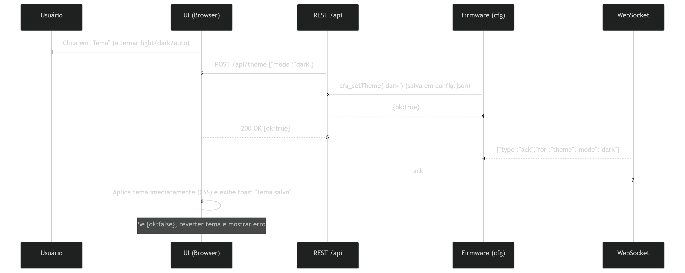

2) Botão Alerta Geral ON/OFF
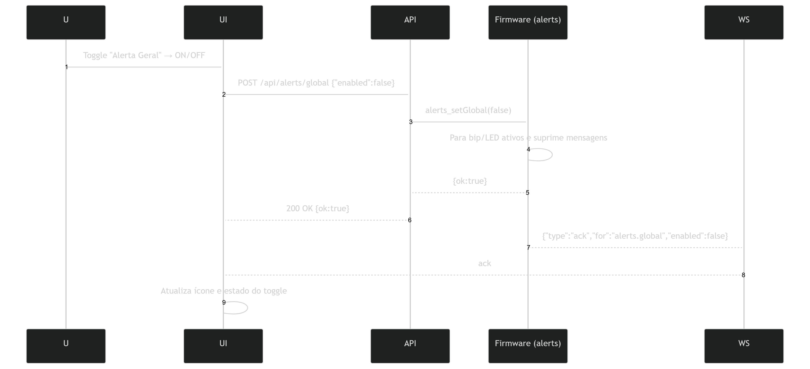
3) Ícone Wi‑Fi (diagnóstico + scan)
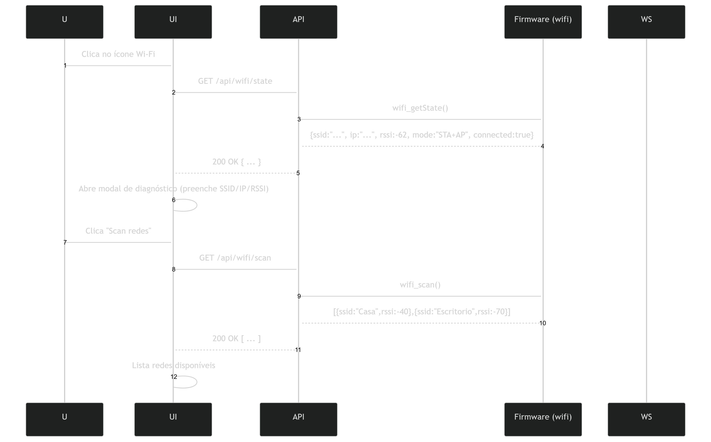
Corpo Principal
4) Botão Modo PWM (Manual/Automático)
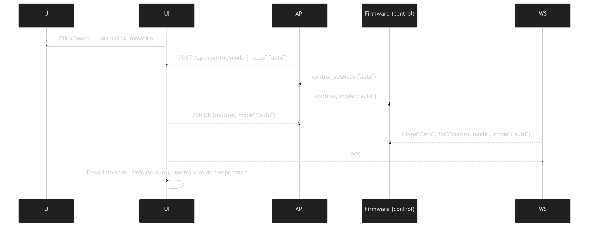
5) (Opcional) Slider PWM Manual
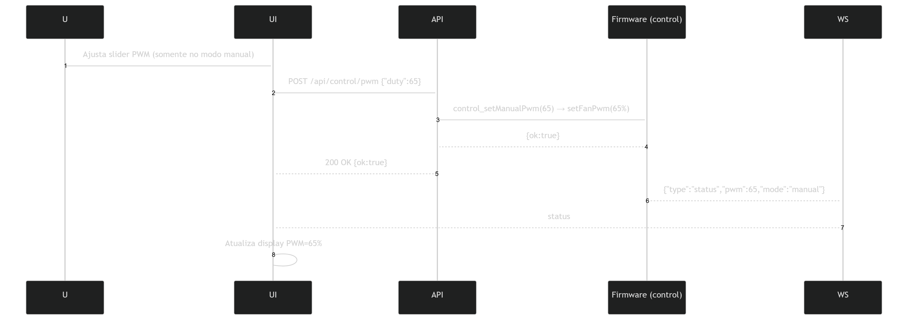
Aba Wi‑Fi
6) Cliente (STA) – Botão Salvar (testa conexão)
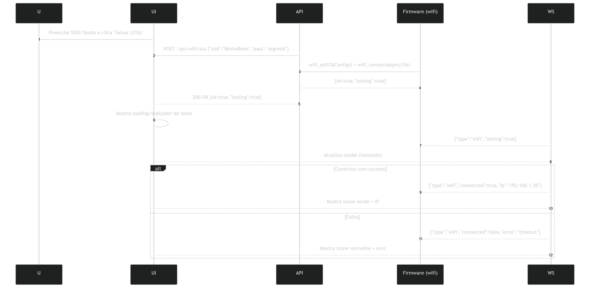
7) Ponto de Acesso (AP) – Botão Salvar
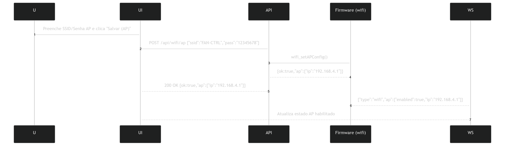
 Aba Alerta
8) Ações (Mensagem/Bip/LED) – Toggles (Salvar)
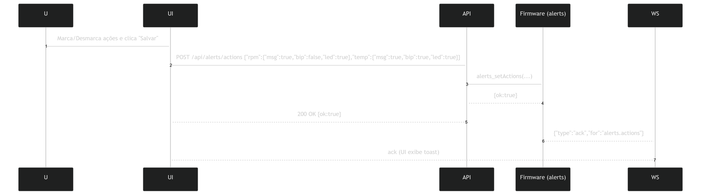
9) Flags (Erro de sensor / Fora de parâmetros) – Toggles (Salvar)
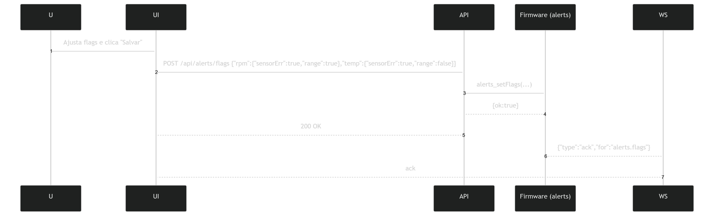
10) Parâmetros (Faixas + Intervalo) – Botão Salvar
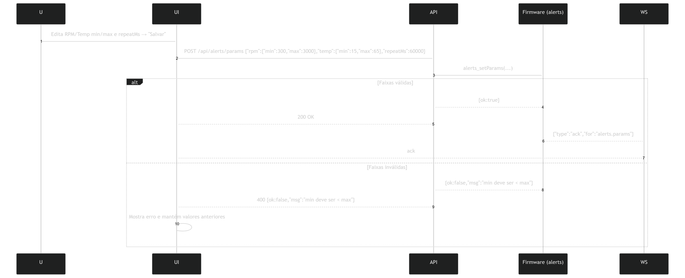
Aba Avançado
11) Modo Simulação – Toggle + Salvar  
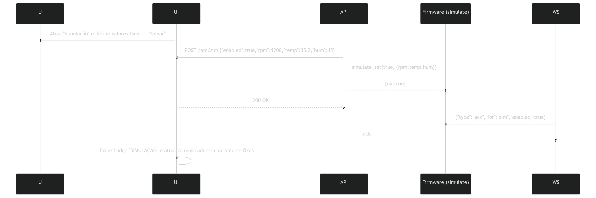
12) Testar Alerta – Botão Bip ON/OFF
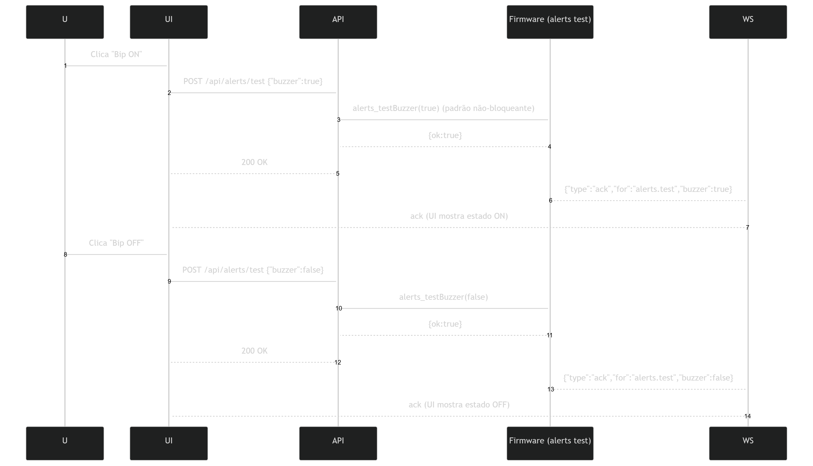
13) Testar Alerta – Botão LED ON/OFF
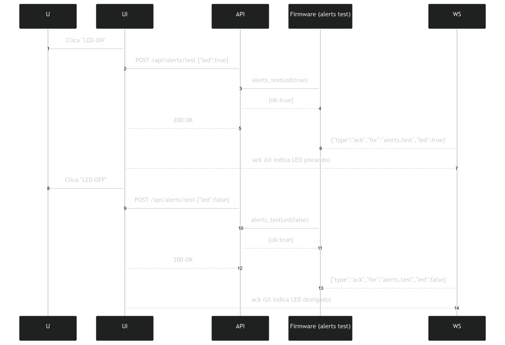
14) Telegram – Botão Salvar Credenciais
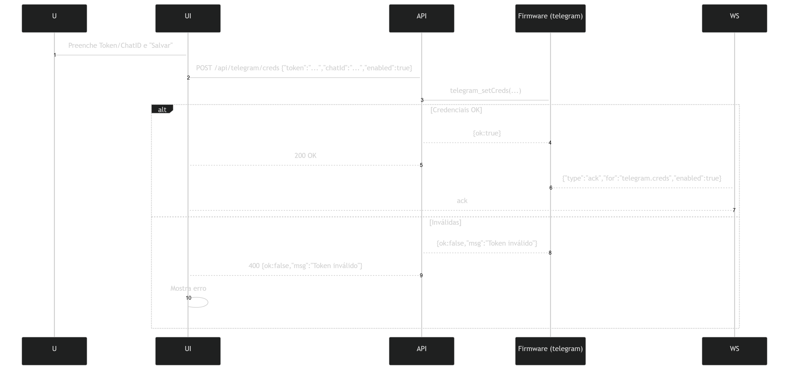
15) Telegram – Botão Enviar Mensagem de Teste
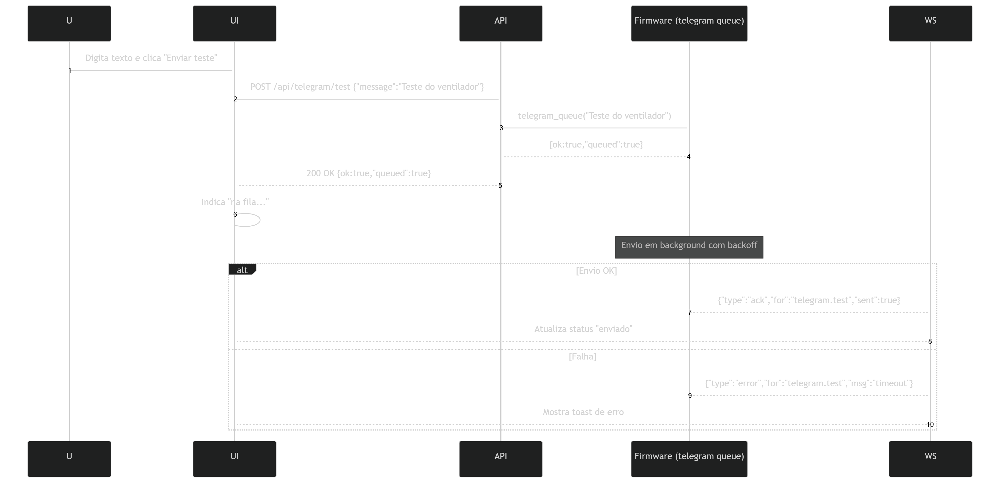
16) Flags Avançado & Debug – Toggles
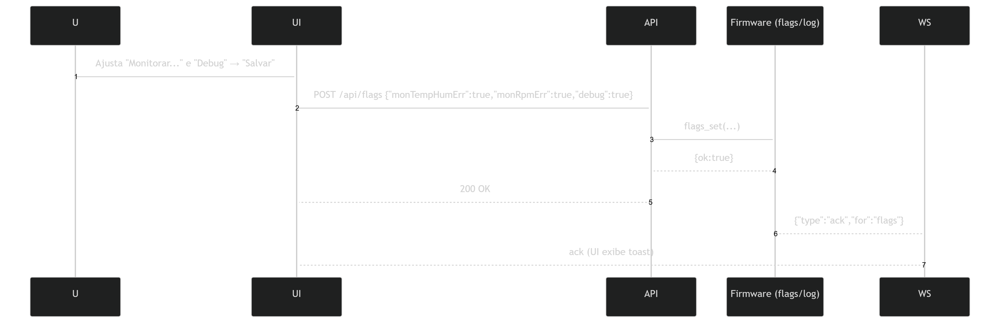
17) Log – Visualizar & Salvar
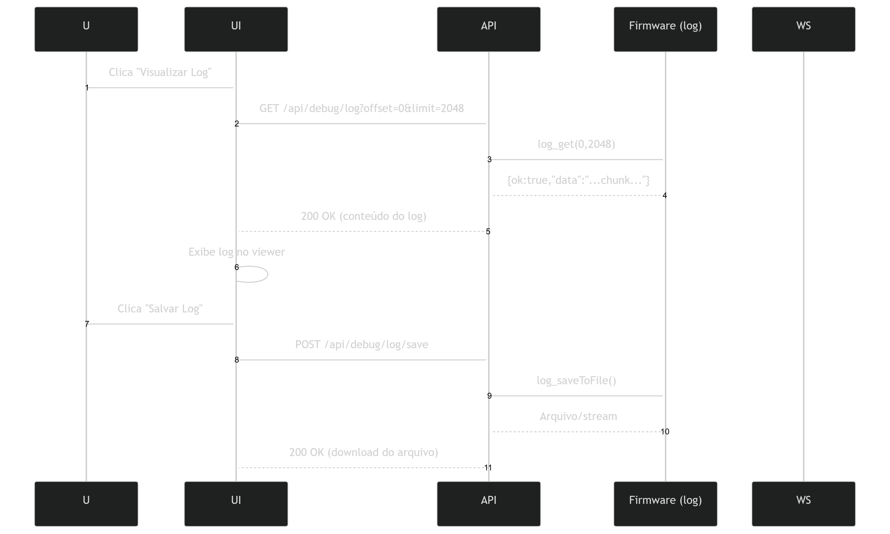
Aba Sistema
18) Alterar Senha – Botão
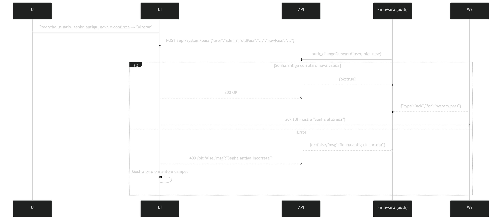
19) Mapeamento de Pinos – Botão Salvar Pinos
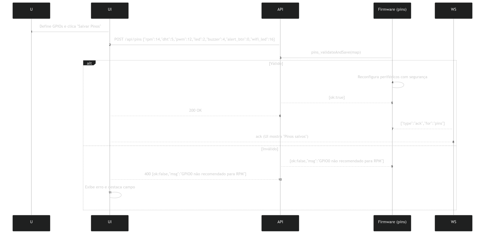
20) Restaurar Configuração Padrão – Botão
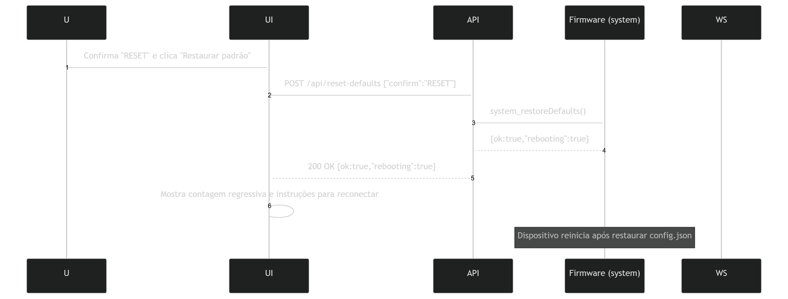

Dica opcional (status automático pós‑ação)
Após qualquer botão, o firmware pode publicar um status atualizado:
JSON{"type":"status","rpm":1234,"temp":33.2,"hum":45,"pwm":60,"mode":"auto","alertsActive":true,"uptime":123456}Mostrar mais linhas
Isso garante que a UI reflita o estado real mesmo se o REST retornar ok mas houver mudança assíncrona logo depois.